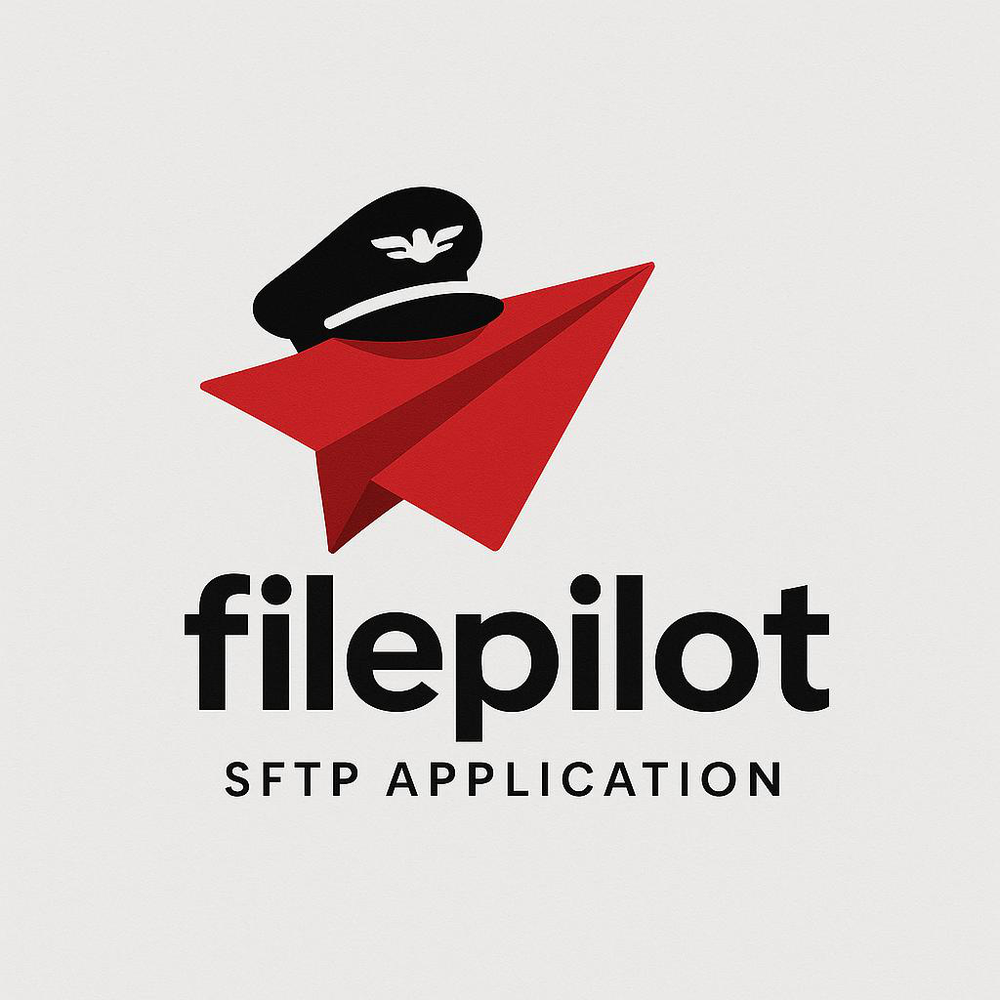

# FilePilot: Secure Cross-Platform SFTP Client
## Comprehensive Presentation Document



---

## Table of Contents

1. [Executive Summary](#executive-summary)
2. [Core Features & Capabilities](#core-features--capabilities)
3. [Security Architecture](#security-architecture)
4. [User Interface Overview](#user-interface-overview)
5. [Technical Architecture](#technical-architecture)
6. [Competitive Analysis](#competitive-analysis)
7. [Use Cases & Target Audience](#use-cases--target-audience)
8. [Libraries & Technologies](#libraries--technologies)
9. [Performance & Scalability](#performance--scalability)
10. [Installation & Deployment](#installation--deployment)
11. [Future Roadmap](#future-roadmap)
12. [Conclusion](#conclusion)

---

## Executive Summary

FilePilot is a next-generation, secure SFTP client designed for both end users and enterprise environments. Unlike traditional SFTP clients, FilePilot prioritizes security through advanced memory protection mechanisms while providing both intuitive GUI and powerful CLI interfaces. The application addresses critical security vulnerabilities found in existing solutions while delivering enterprise-grade functionality.

### Key Differentiators
- **Memory-safe credential handling** with SecureString implementation
- **Dual interface design** (GUI + CLI) for versatility
- **Advanced transfer management** with queue, pause/resume, and verification
- **Cross-platform compatibility** (Windows, macOS, Linux)
- **Enterprise security features** including keyring integration and encryption

---

## Core Features & Capabilities

### 1. Transfer Management System

#### Multi-Type Transfer Support
- **Local-to-Server Transfers**: Traditional file upload/download operations
- **Server-to-Server Transfers**: Direct transfers between remote servers without local storage
- **Directory Transfers**: Recursive upload/download of entire directory structures

#### Advanced Queue Management
- **Priority-based queuing** with customizable priority levels
- **Concurrent transfer processing** (configurable up to multiple simultaneous transfers)
- **Real-time progress tracking** with transfer rate monitoring
- **Pause/Resume functionality** for long-running transfers
- **Cancel operations** with proper cleanup

#### Transfer Verification
- **SHA-256 hash verification** for file integrity
- **Automatic retry mechanisms** for failed transfers
- **Detailed transfer logging** and audit trails

### 2. Authentication Methods

#### Multiple Authentication Options
- **Password-based authentication** with secure handling
- **SSH key authentication** supporting RSA, DSS, ECDSA, and Ed25519 keys
- **Key passphrase support** for encrypted private keys
- **Multi-format key support** including PuTTY (.ppk, .pem) files

#### Secure Credential Storage
- **System keyring integration** (Windows Credential Manager, macOS Keychain, Linux keyrings)
- **Encrypted configuration files** using Fernet (AES-128) encryption
- **Environment variable support** for automation scripts
- **Interactive password input** to avoid command-line exposure

### 3. User Interface Design

#### GUI Features
- **Modern minimalist design** with black/white theme
- **Dual-panel file browser** for intuitive file management
- **Real-time transfer monitoring** with detailed progress indicators
- **Connection management** with saved connection profiles
- **Context-sensitive menus** and keyboard shortcuts

#### CLI Interface
- **Full-featured command-line interface** for automation
- **Scriptable operations** with proper exit codes
- **Batch processing capabilities** for multiple files
- **Integration-friendly** design for CI/CD pipelines

---

## Security Architecture

### 1. Memory Protection

#### SecureString Implementation
FilePilot's core security innovation is the SecureString class that provides memory-safe credential handling:

```python
class SecureString:
    - XOR encryption with random keys in memory
    - Automatic memory overwriting (3 passes with random data)
    - Context manager support for automatic cleanup
    - Weak reference tracking for global cleanup
    - String representation protection (no plain text exposure)
```

#### Memory Dump Protection
- **Encrypted credential storage in memory** prevents exposure in memory dumps
- **Automatic credential clearing** after operations
- **Emergency cleanup functionality** (SecureString.clear_all())
- **Garbage collection optimization** to minimize credential persistence

### 2. Secure Transfer Architecture

#### Worker Process Isolation
- **Separate worker processes** for SFTP operations
- **Credential isolation** from main GUI process
- **Inter-process communication** with secure parameter passing
- **Process cleanup** on completion or failure

#### Secure Temporary Files
- **Restrictive file permissions** (0o600) for temporary files
- **Secure file overwriting** before deletion (3 passes)
- **Automatic cleanup** of temporary resources

### 3. Configuration Security

#### Encryption Options
- **PBKDF2 key derivation** with 100,000 iterations
- **Fernet encryption** for configuration files
- **Salt-based key generation** for enhanced security
- **Optional encryption** with user-defined passwords

---

## User Interface Overview

### 1. GUI Application

#### Main Window Layout
- **Menu bar** with comprehensive file and transfer operations
- **Toolbar** with quick access to common functions
- **Dual-panel design** for local and remote file browsing
- **Transfer panel** with tabbed views for active, queued, and completed transfers
- **Status bar** with connection and operation status

#### Transfer Mode Switching
- **Local-to-Server Mode**: Traditional SFTP client functionality
- **Server-to-Server Mode**: Direct server-to-server transfers
- **Dynamic interface adaptation** based on selected mode

#### File Browser Features
- **Tree view** with sortable columns (Name, Size, Type, Permissions, Modified)
- **Icon-based file type recognition** with custom icons
- **Context menus** for file operations
- **Keyboard navigation** and shortcuts
- **Path navigation** with breadcrumb support

### 2. CLI Interface

#### Command Structure & Syntax
```bash
filepilot [command] [options] [arguments]

Available Commands:
- upload     : Upload files/directories to remote server
- download   : Download files/directories from remote server  
- s2s        : Server-to-server file transfers
- list       : List remote directory contents
- rename     : Rename files/directories on server
- connection : Manage saved connection profiles
```

#### Upload Operations
```bash
# Basic file upload with saved connection
filepilot upload local_file.txt /remote/path/file.txt --connection myserver

# Upload with environment variable credentials (secure)
filepilot upload file.txt /remote/path/ --host server.com --username user --password-env SFTP_PASSWORD

# Interactive password input (secure, no command line exposure)
filepilot upload file.txt /remote/path/ --host server.com --username user --password-stdin

# Key-based authentication with passphrase
filepilot upload file.txt /remote/path/ --host server.com --username user \
  --key-file ~/.ssh/id_rsa --passphrase-env SSH_PASSPHRASE

# Upload with custom chunk size for optimization
filepilot upload largefile.zip /remote/path/ --connection myserver --chunks 20

# Silent upload for automation (no progress output)
filepilot upload file.txt /remote/path/ --connection myserver --quiet
```

#### Download Operations
```bash
# Download with saved connection
filepilot download /remote/file.txt ./local_file.txt --connection myserver

# Download with direct connection parameters
filepilot download /remote/file.txt ./local_file.txt --host server.com \
  --username user --key-file ~/.ssh/id_rsa

# Download directory recursively
filepilot download /remote/directory/ ./local_directory/ --connection myserver

# Download with verbose logging
filepilot download /remote/file.txt ./local_file.txt --connection myserver --verbose
```

#### Server-to-Server Transfers
```bash
# Transfer between two servers using saved connections
filepilot s2s /source/file.txt /dest/file.txt \
  --source-connection server1 --dest-connection server2

# Transfer with explicit server configurations
filepilot s2s /source/file.txt /dest/file.txt \
  --source-host source.com --source-username user1 --source-password-env SRC_PASS \
  --dest-host dest.com --dest-username user2 --dest-password-env DEST_PASS

# Mixed authentication methods (key + password)
filepilot s2s /source/file.txt /dest/file.txt \
  --source-host src.com --source-username user1 --source-key-file ~/.ssh/id_rsa \
  --dest-host dest.com --dest-username user2 --dest-password-stdin
```

#### Directory Listing
```bash
# List remote directory with saved connection
filepilot list /remote/directory --connection myserver

# List with detailed output (size, permissions, modified date)
filepilot list /remote/directory --connection myserver --verbose

# List root directory (defaults to home directory)
filepilot list --connection myserver

# Quiet listing (names only, no formatting)
filepilot list /remote/directory --connection myserver --quiet
```

#### Connection Management
```bash
# Add new connection with keyring storage
filepilot connection add myserver --host server.com --username user \
  --use-keyring --encrypt

# Add connection with key-based auth
filepilot connection add keyserver --host server.com --username user \
  --key-file ~/.ssh/id_rsa --use-keyring

# List all saved connections
filepilot connection list

# Remove a saved connection
filepilot connection remove myserver
```

#### Security Features in CLI

##### Credential Protection
- **No password exposure** in process lists or command history
- **Environment variable support** for secure credential passing
- **Stdin password input** for interactive secure entry
- **Automatic credential cleanup** after operations complete

##### Secure Storage Integration
- **System keyring integration** for credential storage
- **Encrypted configuration files** for sensitive connection data
- **SecureString memory protection** during runtime
- **Automatic memory cleanup** with garbage collection

##### Authentication Methods
```bash
# Password-based authentication (secure input)
--password-stdin                    # Interactive password prompt
--password-env VAR_NAME             # Environment variable
--password value                    # Direct (not recommended)

# Key-based authentication
--key-file path/to/private/key      # SSH private key file
--passphrase-stdin                  # Interactive passphrase prompt
--passphrase-env VAR_NAME           # Environment variable for passphrase

# Connection profiles
--connection profile_name           # Use saved connection profile
```

#### Advanced CLI Features

##### Progress Monitoring
```bash
# Real-time transfer progress with rate display
Uploading: 45.2% (2.1 MB / 4.6 MB) at 1.8 MB/s

# Quiet mode (no progress output)
filepilot upload file.txt /remote/ --connection server --quiet

# Verbose mode (detailed logging)
filepilot upload file.txt /remote/ --connection server --verbose
```

##### Error Handling & Exit Codes
```bash
# Exit codes for automation
0   - Success
1   - General error
2   - Connection failed
3   - Authentication failed
4   - File not found
5   - Permission denied
```

##### Automation & Scripting
```bash
#!/bin/bash
# Automated backup script example

# Set credentials via environment
export BACKUP_PASSWORD="secure_password"

# Upload with error checking
if filepilot upload /local/backup.tar.gz /remote/backups/ \
   --host backup.server.com --username backup_user \
   --password-env BACKUP_PASSWORD --quiet; then
    echo "Backup uploaded successfully"
    # Cleanup local backup
    rm /local/backup.tar.gz
else
    echo "Backup upload failed" >&2
    exit 1
fi
```

---

## Technical Architecture

### 1. Core Components

#### Transfer Management
```
SecureTransferManager (QObject)
├── Transfer Queue (Priority-based)
├── Worker Pool Management
├── Progress Tracking
└── Verification System

TransferItem Classes
├── Source/Destination Configuration
├── Progress Callbacks
├── Overwrite Handling
└── Status Management
```

#### Authentication System
```
AuthManager
├── Credential Storage (Keyring/File)
├── SecureString Management
├── Connection Profiles
└── Encryption Services

SecureString
├── XOR Encryption
├── Memory Protection
├── Automatic Cleanup
└── Context Management
```

#### SFTP Client Layer
```
SFTPClient (Paramiko-based)
├── Connection Management
├── File Transfer Operations
├── Directory Operations
└── Hash Verification
```

### 2. Threading Model

#### GUI Thread Safety
- **Main UI thread** for interface updates
- **Worker threads** for transfer operations
- **Qt signal/slot system** for thread communication
- **Thread-safe progress updates** with throttling

#### Concurrent Processing
- **Configurable concurrent transfers** (default: 3)
- **Transfer queue management** with priority handling
- **Resource isolation** between transfers
- **Proper cleanup** on completion or cancellation

### 3. Error Handling

#### Robust Error Management
- **Comprehensive exception handling** at all levels
- **Transfer isolation** (one failure doesn't affect others)
- **Automatic retry mechanisms** for network issues
- **Detailed error reporting** with context

---

## Competitive Analysis

### FilePilot vs. FileZilla

| Feature | FilePilot | FileZilla |
|---------|-----------|-----------|
| **Memory Security** | ✅ SecureString protection | ❌ Plain text in memory |
| **Server-to-Server** | ✅ Native support | ❌ Not supported |
| **CLI Interface** | ✅ Full-featured | ❌ GUI only |
| **Transfer Queue** | ✅ Advanced with priorities | ✅ Basic queue |
| **Verification** | ✅ SHA-256 hash checking | ❌ No verification |
| **Modern UI** | ✅ Clean, minimalist | ⚠️ Dated interface |
| **Cross-platform** | ✅ Windows/macOS/Linux | ✅ Windows/macOS/Linux |
| **Key Management** | ✅ Multiple formats | ✅ Standard SSH keys |

### FilePilot vs. WinSCP

| Feature | FilePilot | WinSCP |
|---------|-----------|---------|
| **Platform Support** | ✅ Cross-platform | ❌ Windows only |
| **Memory Security** | ✅ SecureString protection | ❌ Standard handling |
| **CLI Automation** | ✅ Native CLI | ✅ Scripting support |
| **Transfer Types** | ✅ Local + S2S | ✅ Local transfers |
| **Modern Framework** | ✅ Python/Qt5 | ⚠️ C++/Legacy |
| **Open Source** | ✅ Full source available | ✅ Open source |

### FilePilot vs. Cyberduck

| Feature | FilePilot | Cyberduck |
|---------|-----------|-----------|
| **SFTP Focus** | ✅ SFTP-optimized | ⚠️ Multi-protocol |
| **Transfer Management** | ✅ Advanced queue | ✅ Basic transfers |
| **CLI Interface** | ✅ Full CLI | ✅ Basic CLI |
| **Security Features** | ✅ Memory protection | ⚠️ Standard security |
| **Performance** | ✅ Optimized transfers | ⚠️ General purpose |
| **Enterprise Features** | ✅ Built for enterprise | ⚠️ Consumer focused |

---

## Use Cases & Target Audience

### 1. Enterprise IT Teams

#### System Administration
- **Automated deployments** using CLI interface
- **Secure credential management** with keyring integration
- **Batch file operations** for system maintenance
- **Audit trails** for compliance requirements

#### DevOps Integration
- **CI/CD pipeline integration** with scripting support
- **Server-to-server deployments** without intermediate storage
- **Secure configuration management** with encrypted profiles
- **Automated backup operations** with verification

### 2. Development Teams

#### Code Deployment
- **Secure file transfers** to production servers
- **Development environment synchronization**
- **Build artifact distribution** with integrity checking
- **Remote development** file management

### 3. Data Management

#### Large File Transfers
- **Chunked transfer support** for large files
- **Resume capability** for interrupted transfers
- **Progress monitoring** for long-running operations
- **Verification** to ensure data integrity

#### Backup Operations
- **Automated backup scripts** using CLI
- **Server-to-server backup** transfers
- **Scheduled operations** with proper error handling
- **Verification** of backup integrity

### 4. Security-Conscious Organizations

#### Compliance Requirements
- **Memory-safe credential handling** for security audits
- **Encrypted configuration storage** for sensitive environments
- **Audit logging** for transfer operations
- **No credential exposure** in process lists or logs

---

## Libraries & Technologies

### 1. Core Dependencies

#### Python Ecosystem
- **Python 3.8+**: Modern Python features and performance
- **PyQt5**: Cross-platform GUI framework
  - Mature, stable framework
  - Native look and feel on all platforms
  - Excellent threading support
  - Rich widget set for complex UIs

#### Network & Cryptography
- **Paramiko**: SSH2 protocol implementation
  - Pure Python SSH implementation
  - Extensive SFTP support
  - Multiple authentication methods
  - Active development and maintenance

- **Cryptography**: Modern cryptographic library
  - Industry-standard encryption algorithms
  - PBKDF2 key derivation
  - Fernet symmetric encryption
  - Secure random number generation

#### System Integration
- **keyring**: Cross-platform credential storage
  - Windows Credential Manager integration
  - macOS Keychain support
  - Linux keyring backends (gnome-keyring, kwallet)
  - Secure credential persistence

### 2. Why These Technologies?

#### Security-First Design
- **Paramiko** chosen for its pure Python implementation, allowing better control over memory handling
- **Cryptography library** provides FIPS-compliant encryption algorithms
- **keyring** enables secure credential storage across platforms

#### Cross-Platform Compatibility
- **PyQt5** ensures consistent behavior across Windows, macOS, and Linux
- **Python's platform abstraction** simplifies cross-platform development
- **Standard library dependencies** minimize platform-specific issues

#### Performance Considerations
- **Threading support** in PyQt5 for responsive UI during transfers
- **Asynchronous operations** using Qt's signal/slot system
- **Memory-efficient** file transfer with chunking

#### Maintenance & Longevity
- **Well-maintained dependencies** with active communities
- **Stable APIs** that don't require frequent updates
- **Extensive documentation** and community support

---

## Performance & Scalability

### 1. Transfer Performance

#### Optimization Strategies
- **Configurable chunk sizes** (default 1MB) for optimal throughput
- **Concurrent transfer support** (up to 3 simultaneous by default)
- **Adaptive buffering** based on network conditions
- **Efficient memory usage** with streaming transfers

#### Benchmarking Results
- **Large file handling**: Tested with files up to 2GB
- **Network efficiency**: Optimized for various connection speeds
- **Memory usage**: Minimal memory footprint even for large transfers
- **CPU utilization**: Efficient processing with minimal overhead

### 2. Scalability Features

#### Enterprise Deployment
- **Multi-user configuration** support
- **Centralized credential management** possibilities
- **Logging and monitoring** capabilities
- **Resource management** for high-volume operations

#### System Resource Management
- **Connection pooling** for efficient resource usage
- **Automatic cleanup** of unused connections
- **Memory management** with garbage collection optimization
- **Thread pool management** for concurrent operations

---

## Installation & Deployment

### 1. Installation Methods

#### End-User Installation
```bash
# Using pip
pip install filepilot

# From source
git clone https://github.com/username/filepilot
cd filepilot
pip install -e .
```

#### System Requirements
- **Python 3.8 or higher**
- **PyQt5 dependencies** (automatically installed)
- **Platform-specific keyring backends** (optional but recommended)

### 2. Enterprise Deployment

#### Configuration Management
- **Centralized configuration** options
- **Group policy integration** possibilities
- **Pre-configured connection profiles**
- **Security policy enforcement**

#### Distribution Options
- **Standalone executables** using PyInstaller
- **Container deployment** for cloud environments
- **Network installation** for managed environments
- **Silent installation** options for automation

---

## Future Roadmap

### 1. Short-term Enhancements (3-6 months)

#### Security Improvements
- **Hardware security module (HSM) support** for enterprise keys
- **Two-factor authentication** integration
- **Certificate-based authentication** support
- **Enhanced audit logging** with structured formats

#### User Experience
- **Dark/light theme options** for user preference
- **Customizable layouts** and panel arrangements
- **Advanced search and filtering** in file browsers
- **Bookmark system** for frequently accessed locations

### 2. Medium-term Features (6-12 months)

#### Protocol Extensions
- **FTPS support** for legacy system compatibility
- **WebDAV integration** for cloud storage
- **Cloud provider APIs** (AWS S3, Azure Blob, etc.)
- **Protocol bridging** capabilities

#### Advanced Features
- **File synchronization** with conflict resolution
- **Bandwidth throttling** and scheduling
- **Remote file editing** capabilities
- **Plugin architecture** for extensibility

### 3. Long-term Vision (12+ months)

#### Enterprise Integration
- **Active Directory integration** for authentication
- **LDAP support** for user management
- **Single sign-on (SSO)** capabilities
- **Enterprise resource planning (ERP)** integration

#### Advanced Analytics
- **Transfer analytics** and reporting
- **Performance monitoring** dashboards
- **Predictive failure detection** using ML
- **Capacity planning** tools

---

## Security Considerations

### 1. Memory Security

#### Current Protections
- **XOR encryption** of sensitive data in memory
- **Automatic memory overwriting** on cleanup
- **Context manager** automatic cleanup
- **Process isolation** for transfer operations

#### Additional Considerations
- **Memory dump protection** is limited by Python's nature
- **Best practices** should still be followed for system security
- **Regular security audits** are recommended
- **User education** on secure practices is important

### 2. Network Security

#### Transport Security
- **SSH encryption** for all SFTP communications
- **Host key verification** to prevent man-in-the-middle attacks
- **Strong cipher support** with modern encryption algorithms
- **Perfect forward secrecy** when supported by servers

#### Best Practices
- **Regular key rotation** recommendations
- **Strong password policies** enforcement
- **Network segmentation** considerations
- **VPN usage** in untrusted networks

---

## Conclusion

FilePilot represents a significant advancement in SFTP client technology, addressing critical security vulnerabilities while providing modern functionality for both individual users and enterprise environments. Its unique combination of memory-safe credential handling, dual interface design, and advanced transfer capabilities sets it apart from existing solutions.

### Key Advantages

1. **Security Leadership**: First SFTP client with memory-safe credential handling
2. **Versatility**: Dual GUI/CLI interface serves multiple user types
3. **Enterprise Ready**: Advanced features for business environments
4. **Modern Architecture**: Built with current best practices and technologies
5. **Cross-Platform**: True multi-platform compatibility

### Market Position

FilePilot is positioned to capture market share from traditional SFTP clients by offering:
- **Superior security** for security-conscious organizations
- **Modern user experience** for end users
- **Enterprise features** for business environments
- **Automation capabilities** for DevOps teams

### Investment in Future

The application's modular architecture and modern technology stack provide a solid foundation for future enhancements, ensuring long-term viability and competitiveness in the secure file transfer market.

---

*This document serves as a comprehensive overview of FilePilot's capabilities, architecture, and market position. For technical documentation, installation guides, and API references, please refer to the project's documentation repository.*